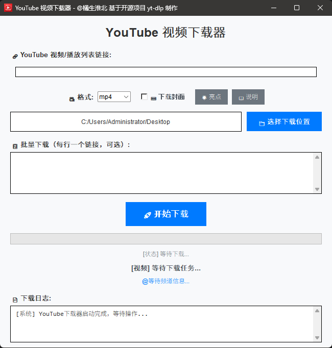

# 🚀 YouTube 视频下载器

[](https://python.org)
[](https://docs.python.org/3/library/tkinter.html)
[](https://github.com/yt-dlp/yt-dlp)
[](LICENSE)



</div>

---

## 🚀 快速开始

```bash
# 1. 克隆仓库
git clone https://github.com/0xf4vul/pytb.git
cd pytb

# 2. 安装依赖
pip install yt-dlp

# 3. 运行程序
python gui_main.py

# 4. 一键打包EXE文件（Windows）(非必须)
pack_silent_optimized.bat
```

---

### 🐛 常见问题

**Q: 提示缺少yt-dlp模块？**  
A: 运行 `pip install yt-dlp` 安装依赖

**Q: 下载失败或速度过慢？**  
A: 可能是网络问题，程序内置智能重试机制

**Q: 如何使用静默退出组件？**  
A: 查看 `components/QUICK_START.md` 3分钟快速入门指南

---

## 📝 许可证

MIT License
